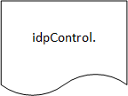

# Pexip Infinity API Intergration Server - VMR_IDP_Classification feature

## Current Features and Functions Overview

1. Display name contsruction based on IDP attributes

1. VMR entry control based on IDP attibutes

2. VMR Classification level change based on participant entry/exit & IDP attribute 'clearance'

## Current Features and Functions Detailed

### Display name contsruction based on IDP attributes

If the participant has IDP attibutes, display name (overlay text) is constructed from config file setting: displayNameBuild

### VMR control based on service_tag & participants IDP attributes

VMR Service tag shall be contructed:

`FeatureAbb_idpAttrTest_idpAttrValue_Class`

Where:
`FeatureAbb` - Future use to select different features modules  - default "IDPC" - if no match default server action continue/reject
`idpAttrTest` - IDP attibute from user to test against idpAttrValue, entry to VMR if values match - default "ANY" - does not perform check
`idpAttrValue` - Value to test againt users value of idpAttrTest - default "ANY" - does not perform check
`Class` - Minuimum classification in IDP attribute 'clearance' required to enter VMR - default "ANY" - classification is changed according to participants

Examples:

`IDPC_department_Navy_ANY`

Members of department 'Navy' allowed into VMR, classification changes on participant join: Lowest classification of all active participant set

`IDPC_department_Navy_SECRET`

Members of department 'Navy' & IDP classification 'SECRET' or higher (VMR theme) allowed into VMR

`IDPC_ANY_ANY_SECRET`

No test on idpAttr, IDP classification 'SECRET' or higher (VMR theme) allowed into VMR

`IDPC_ANY_ANY_ANY`

Any IDP authenticated user (VMR Setting) are allowed into VMR, classification changes on participant join: Lowest classification of all active participant set
